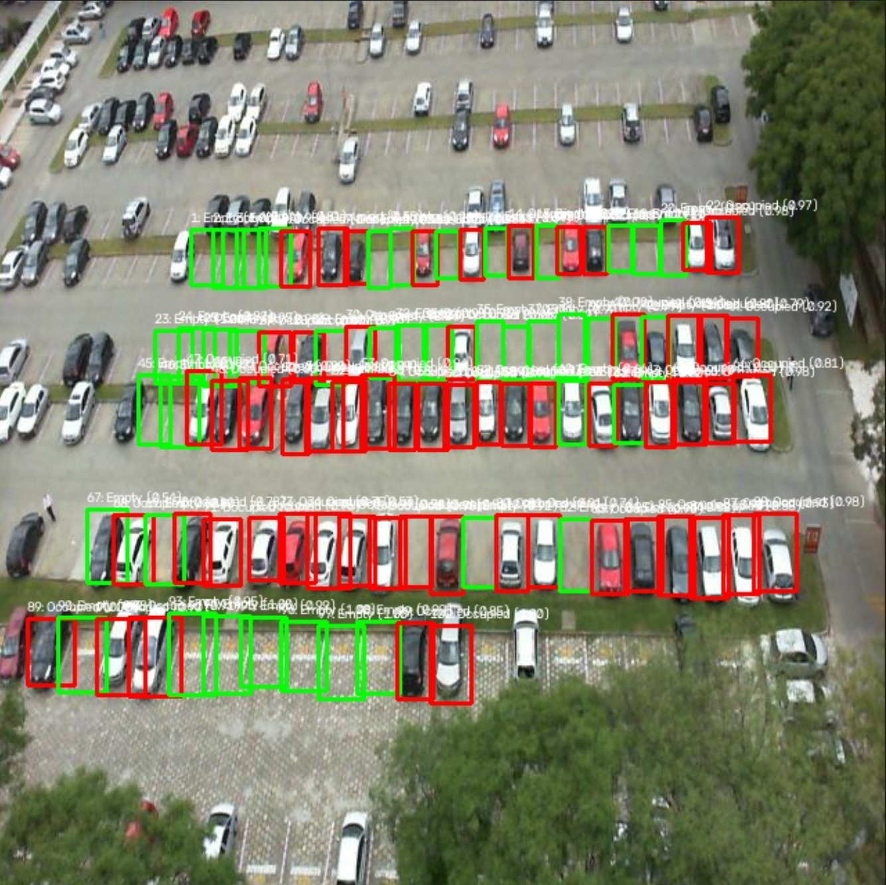
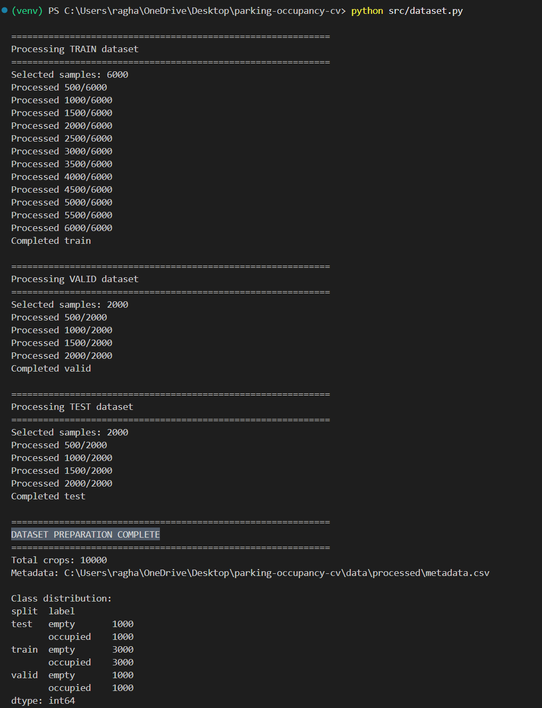
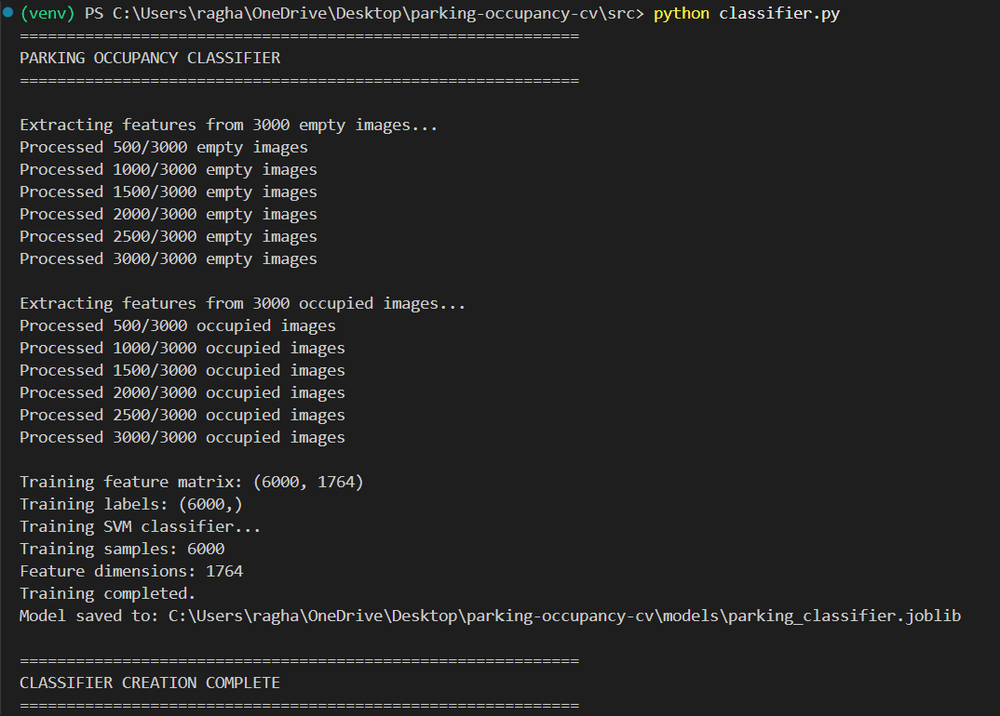
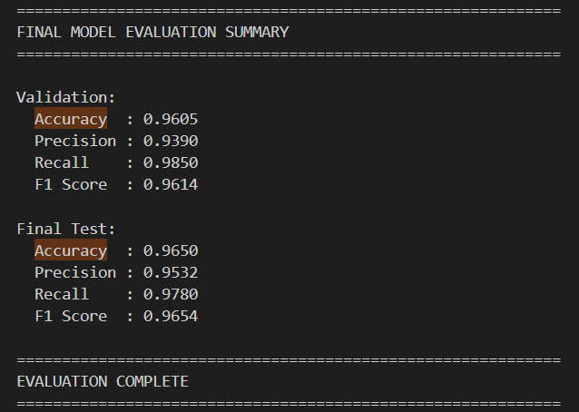
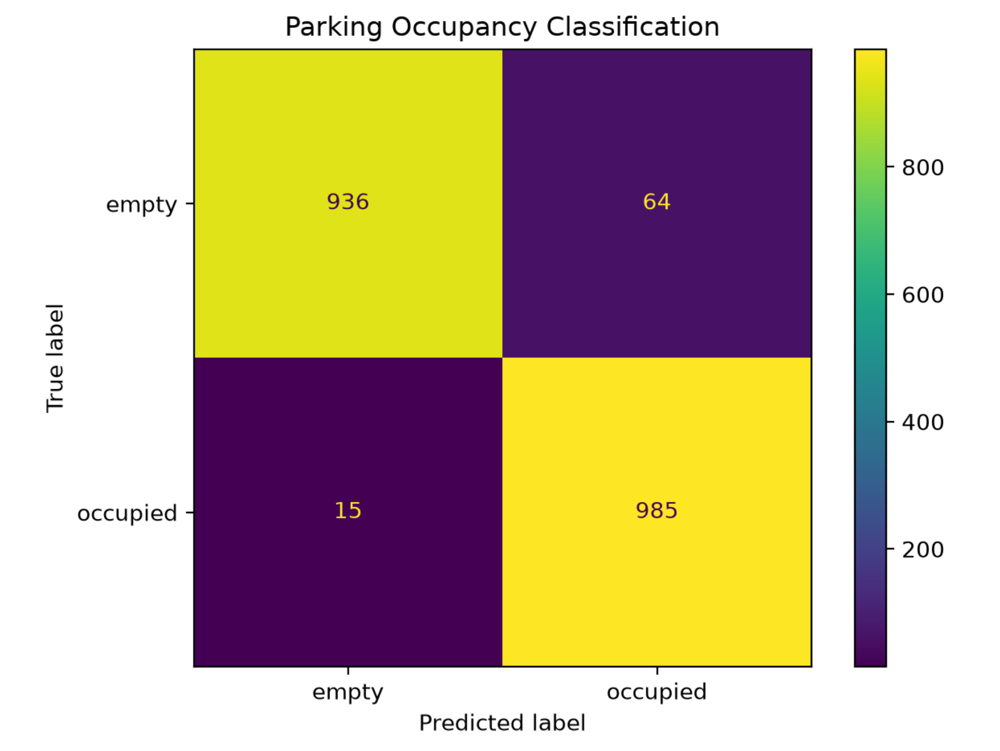
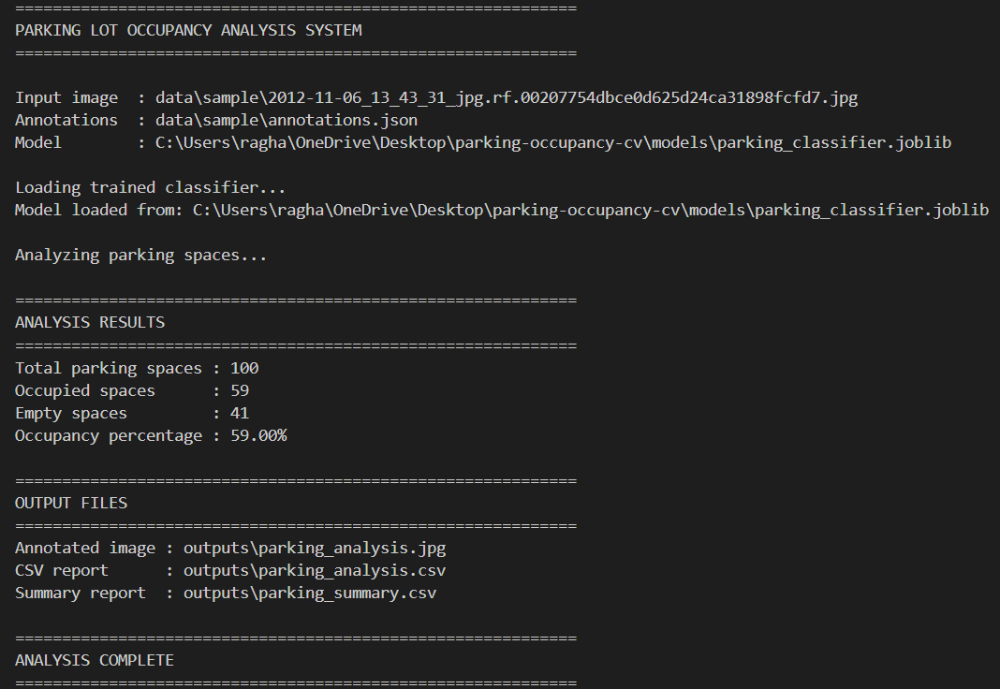
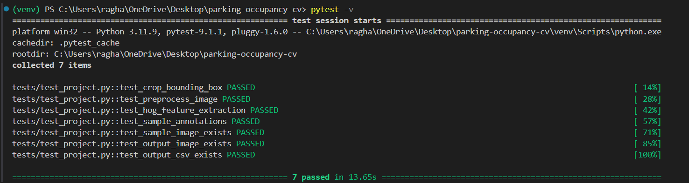

# Computer Vision Based Parking Lot Occupancy Detection and Analysis System

## 1. Project Overview

This project is a computer vision-based parking-lot occupancy analysis system.

The system takes a parking-lot image and identifies individual parking spaces using provided parking-space annotations. Each parking space is cropped and classified as either:

- **Empty**
- **Occupied**

The system then calculates overall parking occupancy and generates:

- An annotated parking-lot image
- A detailed CSV report for individual parking spaces
- A summary CSV report containing occupancy statistics

The occupancy classifier uses **Histogram of Oriented Gradients (HOG)** features with a **Support Vector Machine (SVM)**.

---

### System Preview

The system analyzes individual parking spaces and classifies them as empty
or occupied.



*Figure 1: Annotated parking-lot image showing predicted empty and occupied spaces.*

## 2. Objectives

The main objectives of the project are:

1. Process parking-lot images using computer vision techniques.
2. Extract individual parking-space regions.
3. Preprocess parking-space images into a consistent format.
4. Extract HOG features from parking-space images.
5. Train an SVM classifier to distinguish empty and occupied spaces.
6. Evaluate the classifier using validation and test datasets.
7. Analyze a complete parking-lot image.
8. Calculate parking occupancy statistics.
9. Generate visual and CSV-based analysis reports.

---

## 3. System Features

### Functional Modules

The system consists of the following major modules.

### 3.1 Dataset Processing

Reads COCO-format annotations and extracts individual parking-space crops from the dataset.

### 3.2 Image Preprocessing

Each parking-space image is:

1. Resized to **64 × 64 pixels**
2. Converted to grayscale
3. Normalized to the range **0–1**

### 3.3 HOG Feature Extraction

Histogram of Oriented Gradients (HOG) is used to represent structural and edge information from parking-space images.

The resulting feature vector contains **1,764 features**.

### 3.4 Occupancy Classification

An SVM classifier with an RBF kernel classifies each parking space as:

- `0` → Empty
- `1` → Occupied

Probability calibration is performed using `CalibratedClassifierCV`.

### 3.5 Parking-Lot Analysis

The trained classifier is applied to every parking-space region in an input image.

The system calculates:

- Total parking spaces
- Occupied spaces
- Empty spaces
- Occupancy percentage

### 3.6 Report Generation

The system generates:

- Annotated image
- Per-space CSV report
- Overall occupancy summary CSV

---

## 4. System Workflow

```text
Parking-Lot Image
        |
        v
Parking-Space Annotations
        |
        v
Extract Parking-Space Regions
        |
        v
Resize + Grayscale + Normalize
        |
        v
HOG Feature Extraction
        |
        v
Calibrated SVM Classifier
        |
        v
Empty / Occupied Prediction
        |
        v
Occupancy Analysis
        |
        +--------------------+
        |                    |
        v                    v
Annotated Image        CSV Reports
````

---

## 5. Dataset

The project uses a **PKLot-derived parking-space dataset** provided in COCO annotation format.

The downloaded dataset contains:

```text
data/raw/parking_dataset/
├── train/
├── valid/
└── test/
```

Each split contains:

* Parking-lot images
* `_annotations.coco.json`

### Relevant Categories

The relevant categories are:

```text
1 → space-empty
2 → space-occupied
```

The `spaces` category is not used for occupancy classification.

### Dataset Preparation

The dataset was processed into a balanced subset containing 10,000 parking-space
samples across training, validation, and test splits.



*Figure 2: Dataset preparation and class distribution.*

### Processed Dataset

For model development, a balanced subset was prepared.

#### Training Set

```text
3000 empty
3000 occupied
----------------
6000 samples
```

#### Validation Set

```text
1000 empty
1000 occupied
----------------
2000 samples
```

#### Test Set

```text
1000 empty
1000 occupied
----------------
2000 samples
```

---

## 6. Machine Learning Method

### 6.1 Preprocessing

Each parking-space crop is converted into a standard representation:

```text
Original Image
      |
      v
64 × 64 Resize
      |
      v
Grayscale
      |
      v
Normalization
```

### 6.2 HOG Feature Extraction

HOG is used with the following configuration:

| Parameter           | Value    |
| ------------------- | -------- |
| Orientations        | 9        |
| Pixels per cell     | `(8, 8)` |
| Cells per block     | `(2, 2)` |
| Block normalization | `L2-Hys` |

This produces a feature vector containing:

```text
1764 features
```

### 6.3 Classifier

The classifier is an **RBF-kernel SVM** with the following configuration:

| Parameter | Value |
| --------- | ----- |
| Kernel    | RBF   |
| C         | 10.0  |
| Gamma     | scale |

Probability estimates are calibrated using:

| Parameter        | Value   |
| ---------------- | ------- |
| Method           | sigmoid |
| Cross-validation | 5 folds |

The calibration is performed using `CalibratedClassifierCV`.

### Model Training

The occupancy classifier was trained using 6,000 training samples and
1,764-dimensional HOG feature vectors.



*Figure 3: HOG feature extraction and SVM model training.*

---

## 7. Model Evaluation

The model is evaluated using:

* Accuracy
* Precision
* Recall
* F1 Score
* Confusion Matrix

### Validation Results

| Metric    |  Score |
| --------- | -----: |
| Accuracy  | 96.05% |
| Precision | 93.90% |
| Recall    | 98.50% |
| F1 Score  | 96.14% |

### Final Test Results

| Metric    |      Score |
| --------- | ---------: |
| Accuracy  | **96.50%** |
| Precision | **95.32%** |
| Recall    | **97.80%** |
| F1 Score  | **96.54%** |

The final test set contains **2,000 samples**:

* 1,000 empty
* 1,000 occupied

Confusion matrices are generated for both validation and test evaluation.

### Evaluation Output

The final evaluation shows an accuracy of 96.50% and an F1 score of 96.54%
on the test dataset.



*Figure 4: Final validation and test evaluation results.*

### Test Confusion Matrix



*Figure 5: Confusion matrix for the final test dataset.*

---

## 8. Example Application Result

For the included sample parking-lot image:

| Measure              | Result |
| -------------------- | -----: |
| Total parking spaces |    100 |
| Occupied spaces      |     59 |
| Empty spaces         |     41 |
| Occupancy percentage | 59.00% |

The application generates an annotated image showing individual parking-space
predictions.



*Figure 6: Successful execution of the parking occupancy analysis system.*

### Annotated Parking-Lot Output

The generated image marks predicted empty spaces in green and occupied spaces
in red.


*Figure 7: Generated annotated parking-lot image with occupancy predictions.*

---

## 9. Project Structure

```text
parking-occupancy-cv/
│
├── README.md
├── statement.md
├── requirements.txt
├── .gitignore
├── main.py
├── config.py
│
├── src/
│   ├── __init__.py
│   ├── dataset.py
│   ├── preprocessing.py
│   ├── classifier.py
│   ├── evaluator.py
│   ├── analyzer.py
│   └── reporter.py
│
├── scripts/
│   ├── create_sample.py
│   ├── inspect_dataset.py
│   └── train_model.py
│
├── data/
│   └── sample/
│       ├── sample_image.jpg
│       └── annotations.json
│
├── models/
│   └── parking_classifier.joblib
│
├── outputs/
│
└── tests/
    ├── conftest.py
    └── test_project.py
```

The full raw and processed datasets are not included in the repository because of their size.

The trained model is also excluded from normal Git tracking because of its file size. It can be regenerated using the training pipeline.

---

## 10. Installation

Clone the repository and create a virtual environment.

### Create Virtual Environment

```powershell
python -m venv venv
```

### Activate Virtual Environment on Windows

```powershell
venv\Scripts\Activate.ps1
```

### Install Dependencies

```powershell
pip install -r requirements.txt
```

---

## 11. Dataset Preparation

Place the downloaded dataset under:

```text
data/raw/parking_dataset/
```

The expected structure is:

```text
data/raw/parking_dataset/
├── train/
│   ├── _annotations.coco.json
│   └── *.jpg
│
├── valid/
│   ├── _annotations.coco.json
│   └── *.jpg
│
└── test/
    ├── _annotations.coco.json
    └── *.jpg
```

Run the dataset preparation process:

```powershell
python src/dataset.py
```

This creates the processed parking-space crops under:

```text
data/processed/
```

---

## 12. Train the Model

After preparing the dataset, run:

```powershell
python scripts/train_model.py
```

The trained model is saved as:

```text
models/parking_classifier.joblib
```

---

## 13. Evaluate the Model

Run:

```powershell
python src/evaluator.py
```

This evaluates the model on both validation and test datasets and generates confusion matrices.

---

## 14. Run Parking-Lot Analysis

The application can be executed using:

```powershell
python main.py --image "data/sample/<sample-image>.jpg" --annotations "data/sample/annotations.json"
```

The application generates:

```text
outputs/
├── parking_analysis.jpg
├── parking_analysis.csv
└── parking_summary.csv
```

---

## 15. Run Tests

Run:

```powershell
pytest -v
```

The current project contains **7 automated tests** covering:

* Bounding-box cropping
* Image preprocessing
* HOG feature extraction
* Annotation validation
* Sample-image validation
* Annotated-image generation
* CSV report generation

Current result:

```text
7 passed
```

### Test Execution



*Figure 8: All 7 automated project tests passed successfully.*

---

## 16. Technologies Used

* Python
* OpenCV
* NumPy
* Pandas
* Scikit-learn
* Scikit-image
* Matplotlib
* Joblib
* Pytest

---

## 17. Limitations

The current system uses parking-space bounding-box annotations to determine the location of individual parking spaces.

Therefore, the trained SVM is responsible for occupancy classification, while parking-space localization is provided through the annotation/slot-map information.

The system is designed as an offline image-analysis application and does not currently provide:

* Real-time camera streaming
* Web interface
* Mobile application
* Automatic parking-space detection without annotations
* Database storage

---

## 18. Future Improvements

Possible future improvements include:

1. Automatic parking-space detection without predefined annotations.
2. Real-time video-based occupancy monitoring.
3. Deep-learning-based occupancy classification.
4. Automatic tracking of vehicles across video frames.
5. Historical occupancy storage and analysis.
6. Web-based monitoring dashboard.
7. Deployment on edge devices or CCTV systems.

